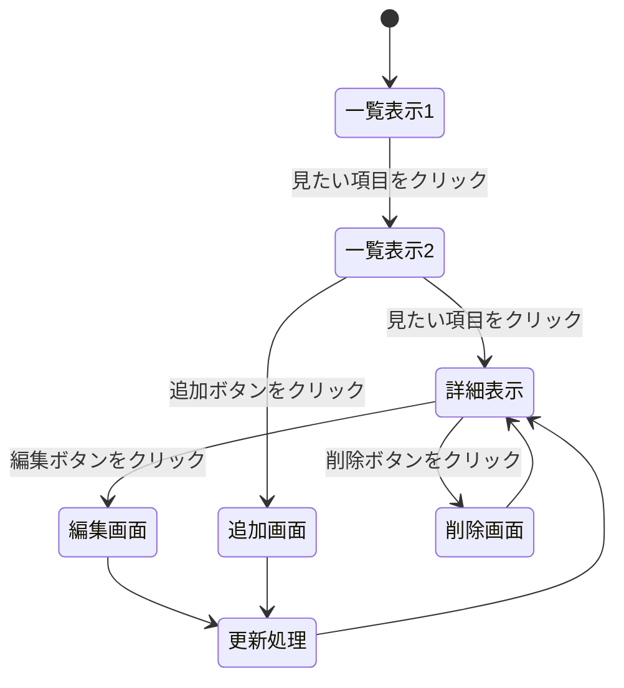

```mermaid
stateDiagram-v2
    [*] --> 一覧表示1
    一覧表示1 --> 一覧表示2:見たい項目をクリック
    一覧表示2 --> 詳細表示: 見たい項目をクリック
    詳細表示 --> 編集画面: 編集ボタンをクリック
    編集画面 --> 更新処理
    更新処理 --> 詳細表示
    一覧表示2 --> 追加画面: 追加ボタンをクリック
    追加画面 --> 更新処理
    詳細表示 --> 削除画面: 削除ボタンをクリック
    削除画面 --> 詳細表示
```