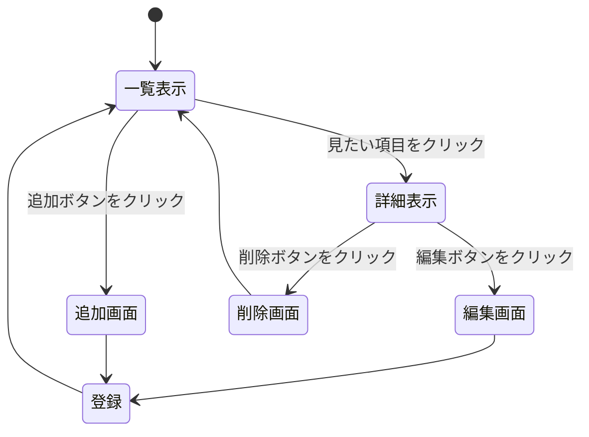

## 開発者用仕様書(仮)

### 開発するシステム一覧

作成するシステムは，都道府県システム，新習志野キャンパスシステム，M-1グランプリシステムの計3つである．

システム名 | 使用するファイル | システムの機能
-|-|-|
都道府県システム|prefec.js, prefec.ejs…|各都道府県に関する情報を，一度に確認できるシステム
新習志野キャンパスシステム| sinnnara.js, sinnnara.ejs…|千葉工業大学の新習志野キャンパスの内部を，理解できるシステム
M-1グランプリシステム | m1.js，m1.ejs…|各年のM-1グランプリの結果を，一望できるシステム

### データ構造

今回開発するシステムのデータの構造について以下に記述する．


```text
- webpro_06
  - prefec.js
  - sinnara.js
  - m1.js
  - views
    - prefec.ejs
    - sinnara.ejs
    - m1.ejs
```
### ページ遷移
各システムのページ遷移について記述する．ページの遷移図を以下に示す．


### HTTPメソッドとリソース名
HTTPメソッドとリソース名について記述する．今回使うメソッドは，get


機能|メソッド | リソース名 
|-|-|-|
一覧表示|GET|/prefec
詳細表示|GET|/prefec/:name
編集|PUT|prefec/edit/:name
削除|DELETE|/prefec/delete/:name
追加|POST|prefec/add/:name
